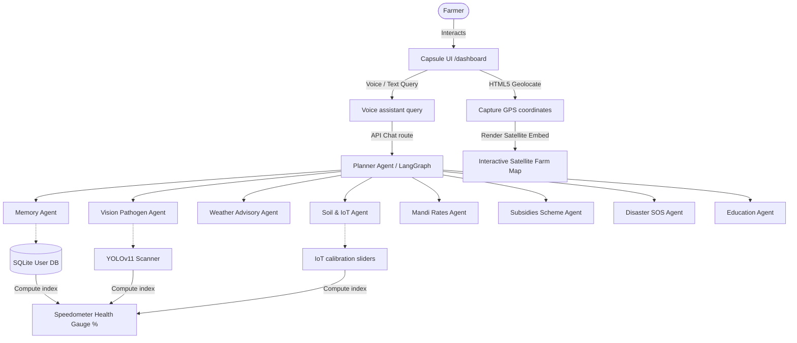

# Kisaanमित्र 🌾

> **"खेती होगी स्मार्ट, भविष्य होगा मजबूत।"**

Kisaanमित्र is an advanced, premium-design **Multi-Agent Farm OS** that integrates computer vision, IoT telemetry, Mandi pricing forecasts, emergency crisis support, and agricultural education into a unified, single-screen dashboard.

Instead of relying on a single chatbot, Kisaanमित्र brings together specialized AI agents for agriculture, crop health, weather, market insights, healthcare, disaster preparedness, and education — working together to give farmers personalized, actionable recommendations.

Built using a stateful LangGraph Multi-Agent network on the backend and Next.js + TailwindCSS on the frontend, Kisaanमित्र converts messy farm inputs (NPK metrics, leaf spots, regional queries) into actionable agriculture planning guides in under 60 seconds.

---

## 🚀 Key System Features

| # | Feature | Description |
|---|---------|--------------|
| 1 | **Top Floating Capsule Navbar (GDG Style)** | Designed after premium capsule layouts, centered and floating on starfield canvases. Features code-brackets branding, seamless tab transitions, localized language toggles, and dynamic notification indicator bells. |
| 2 | **GPS Geolocation & Farmland Satellite Geomap** | Prompts browser location permission on mount. Uses clean Google Satellite embed vectors (`maps.google.com/maps?t=k`) to display real-time farmland layouts inside the dashboard viewport without redirects. Overlays geofenced fields, pulsing IoT sensors, and YOLOv11 pathogen alert beacons dynamically. |
| 3 | **11 Regional Languages Support** | Complete localization dictionary binding across **English, Hindi, Punjabi, Marathi, Telugu, Tamil, Kannada, Gujarati, Bengali, Malayalam, and Odia**. Toggling the globe selector instantly updates voice assistants, leaf diagnostics, Mandi pricing graphs, emergency SOS guidelines, and academic quizzes. |
| 4 | **YOLOv11 Bounding Pathogen Scanner** | Computer vision engine segments crop leaves, alerts on diseases (e.g. Early Blight) with confidence scores, and plots diagnostic bounding boxes. |
| 5 | **Mandi Prices & MSP Tracker** | Scrapes live market Mandi rates, tracks government Minimum Support Prices (MSP), and graphs 6-month historical pricing trends. |
| 6 | **Interactive Krishi Academy** | Audio-guided lessons and gamified quizzes with reward badge trackers. |
| 7 | **Vibration-Feedback Emergency SOS** | Flash flood loss calculators, anti-snake venom locator maps, and pesticide poisoning first-aid guides. |

---

## 🛠️ Technology Stack

- **Frontend**: Next.js 16 (App Router), Webpack Compiler, TailwindCSS, Lucide Icons, HTML5 Geolocation API, Web Speech API.
- **Backend**: FastAPI, LangGraph (Stateful Agent Workflows), SQLAlchemy (Persistent user memory profiles), SQLite (Local fallback storage), Redis (Telemetry caching fallback), Qdrant Vector Database (Cosine similarity semantic RAG searching).
- **Infrastructure**: Docker & Docker Compose (Redis + Qdrant services for local development).

---

## 📊 System Architecture



---

## 🏃 Getting Started & Run Instructions

Ensure **Python 3.10+**, **Node.js 18+**, and **Docker** (with Docker Compose) are installed.

### 1. Clone the repository

```bash
git clone https://github.com/SRV-KILLER09/KisaanMitr.git
cd KisaanMitr
```

### 2. Start supporting services (Redis & Qdrant)

The backend depends on Redis (telemetry caching) and Qdrant (vector search). Start both with Docker Compose before running the backend:

```bash
docker compose up -d
```

This brings up Redis and Qdrant locally, matching the connection settings expected by the backend.

### 3. Configure environment variables

Create a `.env` file inside `backend/` (copy from `.env.example` if present) with values such as:

```env
# LLM provider key used by the LangGraph agents
LLM_API_KEY=your_api_key_here

# Redis
REDIS_URL=redis://localhost:6379

# Qdrant
QDRANT_URL=http://localhost:6333

# Database
DATABASE_URL=sqlite:///./kisaanmitra.db
```

> ⚠️ Update these values/keys to match your actual `backend/app/core` configuration if the variable names differ.

### 4. Setup Backend

```bash
cd backend
pip install -r requirements.txt
uvicorn app.main:app --reload --port 8000
```

*Note: SQLite tables and Qdrant collections will self-seed on startup.*

### 5. Setup Frontend

```bash
cd frontend
npm install
npm run dev
```

Open [http://localhost:3000](http://localhost:3000) to launch Kisaanमित्र.

---

## 📂 Project Directory Structure

```
├── backend/
│   ├── app/
│   │   ├── main.py             # FastAPI entrypoint, seeds database
│   │   ├── core/                # Redis, Qdrant, SQLAlchemy engines
│   │   └── agents/              # LangGraph Multi-agent workflow scripts
│   └── requirements.txt
├── frontend/
│   ├── src/
│   │   ├── app/                 # Next.js pages (/auth, /dashboard)
│   │   └── components/
│   │       ├── ui/              # Interactive 3D constellation shell
│   │       └── dashboard/       # Voice, Vision, Mandi, SOS, & FarmMap components
│   └── package.json
├── docker-compose.yml           # Redis + Qdrant local services
└── .gitignore
```

---

## 🤝 Contributing

Contributions are welcome! Please open an issue to discuss what you'd like to change before submitting a pull request.

1. Fork the repository
2. Create a feature branch (`git checkout -b feature/your-feature`)
3. Commit your changes
4. Open a pull request

---

## 📄 License

This project is licensed under the [MIT License](./LICENSE).

---


<br>
<div align="center">

Made with ❤️ by [**Team Quintara**](https://github.com/SRV-KILLER09/KisaanMitr) · @2026

</div>


---


---


---


---


---


---


---


---


---


---


---


---


---


---


---


---


---


---


---


